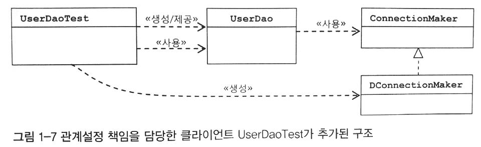
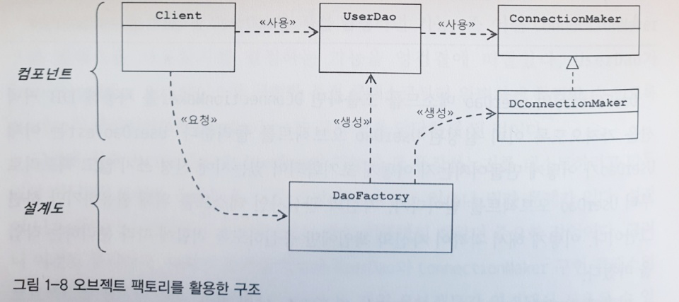

## 의존관계

#### DAO

#### 원칙과 패턴: 개방 페쇄(OCP)

\* SOLID

1. SRP :Single Responsibility Principle(단일 책임 원칙)

2. OCP: Open Closed Principle(개방 폐쇄 원칙)

3. LSP: Liskov Subsitution Principle(리스코프 치환 원칙)

4. ISP: Interface Segregation Principle(인터페이스 분리 원칙)

5. DIP: Dependency Inversion Principle(의존관계 역전 원칙)

\* 높은 응집도와 낮은 결합도

높은 응집도
- 변화가 일어날 때 해당 모듈에서 변하는 부분이 크다
- 모듈의 일부분에만 변경이 일어나도 된다면 -> 1. 전체에서 어떤 부분이 바뀌어야 하는지, 2. 바뀌지 않는 부분에 다른 영향을 미치지는 않는지 확인해야 하는 이중부담

낮은 결합도
- 책임과 관심사가 다른 오브젝트 또는 모듈과 느슨한 연결 형태 유지
- 결합도가 낮아지면 -> 변화 대응 속도 상승, 깔끔한 구성, 확장에 편리

\* 전략 패턴
- 변경이 필요한 알고리즘을 인터페이스를 통해 통째로 외부에 분리, 구현 클래스를 필요에 따라 바꿔 사용하게끔 하는 디자인 패턴

## 제어의 역전 (IoC)

#### 팩토리
- 목적: 오브젝트 생성 / 생성된 오브젝트 사용 각 역할과 책임을 분리
- 오브젝트 팩토리로서의 활용

\* Bean
- 스프링이 IoC 방식으로 관리하는 오브젝트
- 스프링이 직접 생성과 제어를 담당하는 오브젝트만 해당

\* Bean Factory
- IoC 담당 핵심 컨테이너. 빈 등록, 생성, 조회, 리턴 및 관리 기능.

\* 애플리케이션 컨텍스트
- Bean Factory를 확장한 IoC 컨테이너, 스프링의 애플리케이션 지원 기능을 포함

\* Configuration
- IoC를 적용하기 위해 사용하는 메타정보

## 싱글톤 패턴과 싱글톤 레지스트리

#### 싱글톤
- 목적: 서버(멀티스레드) 환경에서 하나의 오브젝트를 여러 스레드 요청이 공유
- 한계
    1. 상속 불가(private 생성자)
    2. 테스트 어려움
    3. 서버환경에서 싱글톤 1개임을 보장 불가
    4. 전역상태의 가능성이 있어 바람직하지 못함

#### 싱글톤 레지스트리
- 장점
    1. 일반 Java 클래스를 싱글톤으로 활용 가능: 생성, 관계설정 등의 제어권을 컨테이너에 부여
    2. 싱글톤 방식 애플리케이션 클래스는 public 생성자 사용 가능
    3. 테스트 용이
    4. 객체지향적 설계 방식, 디자인 패턴 적용에 제한 없음

## 의존관계 주입(DI)

