# 1장. 오브젝트와 의존관계

# 들어가며
## 스프링이란 무엇인가?

- 애플리케이션의 기본 틀
    - 스프링 컨테이너 / 애플리케이션 컨텍스트라고 불리는 스프링 런타임 엔진 제공
    - 스프링 컨테이너는 설정 정보를 토대로 애플리케이션을 구성하는 오브젝트(빈) 관리
        - 애플리케이션 컨텍스트라는 이름대로 애플리케이션이 서비스라는 문맥 속 필요한 기능을 제공하기 위한 모든 빈들을 관리하는 용도
- 공통 프로그래밍 모델
    - IoC/DI
        - 오브젝트의 생명주기와 의존관계에 대한 프로그래밍 모델
        - 스프링의 핵심
    - 서비스 추상화(PSA, Portable Service Abstractions)
        - 구체적인 기술과 환경에 종속되지 않도록 유연한 추상 계층을 두는 방법
            - @Transactional과 같이 하위 시스템의 공통점을 추상화시켜 분리한 계층
    - 기술 API
        - 다양한 영역에 활용할 수 있는 API 제공

# 초난감 DAO
```java
public class UserDao {

    public void add(User user) throws ClassNotFoundException, SQLException {
        Class.forName("com.mysql.jdbc.Driver");
        Connection c = DriverManager.getConnection(
                "jdbc:mysql://localhost/springbook?characterEncoding=UTF-8",
                "spring",
                "book"
        );

        PreparedStatement ps = c.prepareStatement(
                "insert into users(id, name, password) values(?,?,?)"
        );
        ps.setString(1, user.getId());
        ps.setString(2, user.getName());
        ps.setString(3, user.getPassword());

        ps.executeUpdate();

        ps.close();
        c.close();
    }

    public User get(String id) throws ClassNotFoundException, SQLException {
        Class.forName("com.mysql.jdbc.Driver");
        Connection c = DriverManager.getConnection(
                "jdbc:mysql://localhost/springbook?characterEncoding=UTF-8",
                "spring",
                "book"
        );
        PreparedStatement ps = c.prepareStatement("select * from users where id = ?");
        ps.setString(1, id);

        ResultSet rs = ps.executeQuery();
        rs.next();
        
        User user = new User();
        user.setId(rs.getString("id"));
        user.setName(rs.getString("name"));
        user.setPassword(rs.getString("password"));

        rs.close();
        ps.close();
        c.close();

        return user;
    }
}
```
- JDBC를 이용한 등록 / 조회 기능이 있는 DAO

# DAO의 분리

- 객체지향의 세계에서는 모든 것이 변함
    - 사용자의 비즈니스 프로세스와 그에 따른 요구사항은 끊임없이 바뀌고 발전함
    - 분리와 확장을 고려한 설계를 통해 변화의 폭을 최소한으로 줄여 대처할 수 있음
        - 분리
            - 애플리케이션이 변경될 경우 하나의 관심사에 집중해 변경사항이 발생함
            - 관심사가 하나라고 하더라도 여러 구간의 코드에서 변경이 발생할 수 있음

```java
// DB 커넥션을 위한 코드
Class.forName("com.mysql.jdbc.Driver");
Connection c = DriverManager.getConnection(
        "jdbc:mysql://localhost/springbook?characterEncoding=UTF-8",
        "spring",
        "book"
);

// 쿼리 실행을 위한 코드
PreparedStatement ps = c.prepareStatement("select * from users where id = ?");
ps.setString(1, id);

// 리소스를 반환하기 위한 코드
ps.close();
c.close();
```

- UserDao는 여러 관심사를 가지고 있음 → 관심사의 분리가 제대로 이루어지지 않음
    - DB 커넥션을 위한 코드
    - 쿼리 실행을 위한 코드
    - 리소스를 반환하기 위한 코드

```java
public void add(User user) throws ClassNotFoundException, SQLException {
    Connection c = getConnection(); // 중복 코드 메서드 추출
    
    ...
}

public void get(String id) throws ClassNotFoundException, SQLException {
    Connection c = getConnection(); // 중복 코드 메서드 추출
    
    ...
}

private Connection getConnection() throws ClassNotFoundException, SQLException {
    Class.forName("com.mysql.jdbc.Driver");
    Connection c = DriverManager.getConnection(
            "jdbc:mysql://localhost/springbook?characterEncoding=UTF-8",
            "spring",
            "book"
    );
    return c;
}
```

- 메서드 추출 기법을 통해 중복 코드를 별도의 메서드로 분리
    - getConnection() 변경 시 add(), get()은 영향을 받지 않음
    - 등록 / 조회를 위한 UserDao이지만 DB 커넥션 내용 변경 시 UserDao가 변경되어야 함

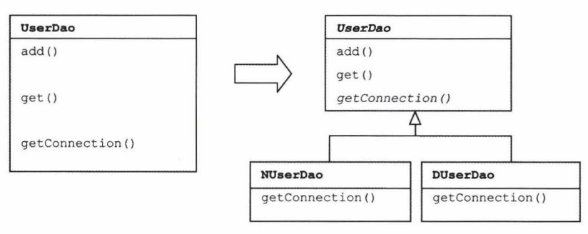

```java
public abstract class UserDao {

    abstract protected Connection getConnection() throws ClassNotFoundException, SQLException;
    
    ...
}

public class NUserDao extends UserDao {

    protected Connection getConnection() throws ClassNotFoundException, SQLException {
       	// N사의 Connection 획득		
    }
}

public class DUserDao extends UserDao {

    protected Connection getConnection() throws ClassNotFoundException, SQLException {
        // D사의 Connection 획득			
    }
}
```

- DB 커넥션 내용을 유연하게 확장할 수 있도록 추상 메서드와 상속을 활용해 확장
    - NUserDao, DUserDao에서 DB 커넥션 내용이 변경되어도 UserDao는 영향을 받지 않음

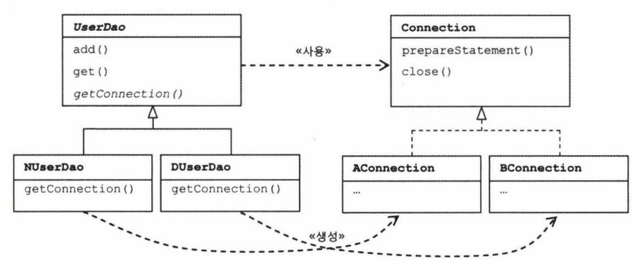

- 사용한 디자인 패턴
    - 템플릿 메서드 패턴
        - 슈퍼 클래스 UserDao에 기본적인 로직의 흐름 생성
        - 기능의 일부를 추상 메서드 / 오버라이딩이 가능한 메서드로 생성
        - 서브 클래스에서 메서드를 필요에 맞게 오버라이딩
    - 팩토리 메서드 패턴
        - 서브 클래스에서 구체적인 오브젝트 생성 방법을 결정

- 상속을 통한 확장의 단점
    - 다중 상속을 지원하지 않으므로 선택지가 하나 사라짐
    - 슈퍼 클래스와 서브 클래스가 강결합되어 슈퍼 클래스의 변경이 서브 클래스에 영향을 미치게 됨

## 스프링에서의 확장

- 스프링에서는 다양한 구간에서 템플릿 메서드 패턴을 활용하고 있음
- 대표적인 예시 : AbstractApplicationContext

```java
@Override
public void refresh() throws BeansException, IllegalStateException {
    this.startupShutdownLock.lock();
    try {
        this.startupShutdownThread = Thread.currentThread();

        StartupStep contextRefresh = this.applicationStartup.start("spring.context.refresh");

        // Prepare this context for refreshing.
        prepareRefresh();

        // Tell the subclass to refresh the internal bean factory.
        ConfigurableListableBeanFactory beanFactory = obtainFreshBeanFactory();

        // Prepare the bean factory for use in this context.
        prepareBeanFactory(beanFactory);

        try {
            // Allows post-processing of the bean factory in context subclasses.
            postProcessBeanFactory(beanFactory);

            StartupStep beanPostProcess = this.applicationStartup.start("spring.context.beans.post-process");
            // Invoke factory processors registered as beans in the context.
            invokeBeanFactoryPostProcessors(beanFactory);
            // Register bean processors that intercept bean creation.
            registerBeanPostProcessors(beanFactory);
            beanPostProcess.end();

            // Initialize message source for this context.
            initMessageSource();

            // Initialize event multicaster for this context.
            initApplicationEventMulticaster();

            // Initialize other special beans in specific context subclasses.
            onRefresh();

            // Check for listener beans and register them.
            registerListeners();

            // Instantiate all remaining (non-lazy-init) singletons.
            finishBeanFactoryInitialization(beanFactory);

            // Last step: publish corresponding event.
            finishRefresh();
        }

        catch (RuntimeException | Error ex ) {
            if (logger.isWarnEnabled()) {
                logger.warn("Exception encountered during context initialization - " +
                        "cancelling refresh attempt: " + ex);
            }

            // Destroy already created singletons to avoid dangling resources.
            destroyBeans();

            // Reset 'active' flag.
            cancelRefresh(ex);

            // Propagate exception to caller.
            throw ex;
        }

        finally {
            contextRefresh.end();
        }
    }
    finally {
        this.startupShutdownThread = null;
        this.startupShutdownLock.unlock();
    }
}
```

- AbstractApplicationContext.refresh()
    - 스프링 컨테이너 라이프사이클에서 핵심적인 역할 수행
        - 컨테이너 초기화 및 구성
        - 환경 설정
        - 이벤트 처리 시스템 초기화 및 이벤트 리스너 등록
        - 국제화(MessageSource) 초기화
        - 빈 등록
    - refresh() 메서드 내 호출되는 메서드는 대부분 훅 메서드이며, 접근 제어자가 protected로 선언되어 있음
    - 필요 시 AbstractApplicationContext를 확장하는 서브 클래스들이 이를 구현

      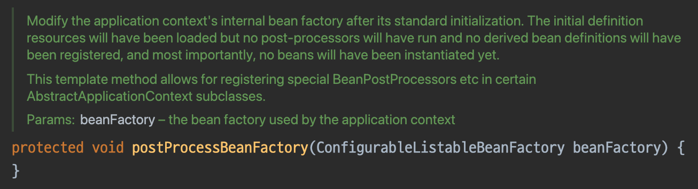

      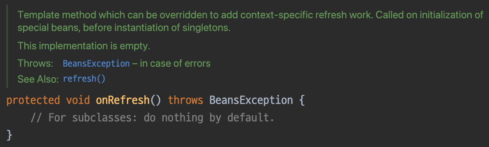

- 스프링은 확장을 통한 슈퍼 클래스와 서브 클래스의 강결합을 감수하면서 다음과 같은 장점을 얻음
    - 일관성 있는 제어
        - ApplicationContext의 핵심 라이프 사이클 및 동작을 일관되게 유지
        - 특정 부분에서만 훅 메서드를 통해 커스터마이징 허용
        - 스프링의 핵심 기능이 예측 가능하고 안정적으로 동작하도록 보장
    - 프레임워크의 안정성
        - 핵심 로직을 AbstractApplicationContext에 두고 변경을 제한
        - 프레임워크의 중요한 부분이 예기치 않게 변경되는 것을 방지
- UserDao에서 확장을 통한 방법이 유효하지 않은 이유
    - 슈퍼 클래스와 서브 클래스의 강결합을 감수하면서까지 일관성 있는 제어가 필요하지 않음
        - 단순히 DB 커넥션을 가져오는 로직이기 때문
    - DB 커넥션 관련 코드는 UserDao의 핵심 관심사와는 거리가 멂

# DAO의 확장

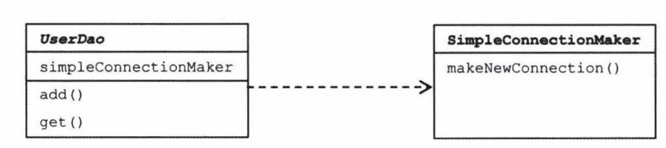

- DB 커넥션 관련 코드를 별도의 클래스로 분리

```java
public class SimpleConnectionMaker {

    public Connection getConnection() throws ClassNotFoundException, SQLException {
        Class.forName("com.mysql.jdbc.Driver");
        Connection c = DriverManager.getConnection(
                "jdbc:mysql://localhost/springbook?characterEncoding=UTF-8", 
                "spring", 
                "book"
        );
        
        return c;
    }
}

public abstract class UserDao {

    private SimpleConnectionMaker simpleConnectionMaker;

    public UserDao() {
        this.simpleConnectionMaker = new SimpleConnectionMaker();
    }

    public void add(User user) throws ClassNotFoundException, SQLException {
        Connection c = this.simpleConnectionMaker.getConnection();
        
        ...
    }

    public User get(String id) throws ClassNotFoundException, SQLException {
        Connection c = this.simpleConnectionMaker.getConnection();
        
        ...
    }
}
```

- DB 커넥션 관련 내용을 별도의 클래스인 SimpleConnectionMaker로 분리
- 문제점
    - 상속을 통해 확장한 방식과 달리 구체적으로 DB 커넥션을 만드는 대상과 강결합되어 있음
        - SimpleConnectionMaker.openConnection()이라는 클래스와 메서드를 정확히 알고 있어야 함
        - 변경, 확장 시 SimpleConnectionMaker를 알고 있는 모든 대상에 영향을 끼침

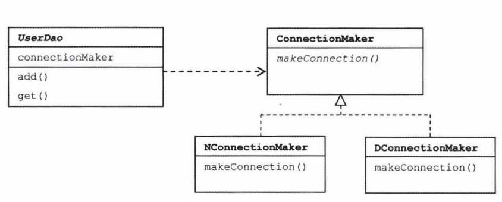

- 인터페이스 도입
    - SimpleConnectionMaker라는 구체적인 클래스가 아닌, ConnectionMaker라는 추상적인 인터페이스에 의존
    - NConnectionMaker가 변경되더라도 ConnectionMaker를 알고 있는 다른 대상은 영향을 받지 않음

```java
public interface ConnectionMaker {

    Connection makeConnection() throws ClassNotFoundException, SQLException;
}

public class DConnectionMaker implements ConnectionMaker {

    public Connection makeConnection() throws ClassNotFoundException, SQLException {
        Class.forName("com.mysql.jdbc.Driver");
        Connection c = DriverManager.getConnection(
            "jdbc:mysql://localhost/springbook?characterEncoding=UTF-8", 
            "spring", 
            "book"
        );
                
        return c;
    }
}

public class UserDao {

    private ConnectionMaker connectionMaker;

    public UserDao(ConnectionMaker simpleConnectionMaker) {
        this.connectionMaker = new DConnectionMaker();
    }

    public void add(User user) throws ClassNotFoundException, SQLException {
        Connection c = this.connectionMaker.makeConnection();
        
        ...
    }

    public User get(String id) throws ClassNotFoundException, SQLException {
        Connection c = this.connectionMaker.makeConnection();
        
        ...
    }
}
```

- UserDao가 ConnectionMaker를 의존하고 있으므로 DConnectionMaker가 변경되더라도 영향을 덜 받음
    - 영향을 덜 받는 이유는 UserDao가 생성자에서 의존 관계를 주도적으로 결정하고 있기 때문

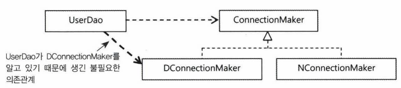

- UserDao가 의존 관계를 주도적으로 하고 있기 때문에 DConnectionMaker와도 의존 관계가 생기고 있음
    - 실제로 사용하는 것은 ConnectionMaker이기 때문에 불필요한 의존관계

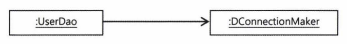

- UserDao는 컴파일 시점에서는 추상적인 ConnectionMaker와만 의존해야 하며, 실제 사용하는 DConnectionMaker는 런타임 시점에 다이나믹하게 의존해야 함

```java
public class UserDao {

    private ConnectionMaker connectionMaker;

    public UserDao(ConnectionMaker simpleConnectionMaker) {
        this.connectionMaker = simpleConnectionMaker;
    }
    
    ...
}

public class UserDaoTest {

    public static void main(String[] args) throws ClassNotFoundException, SQLException {
        ConnectionMaker connectionMaker = new DConnectionMaker();
        UserDao dao = new UserDao(connectionMaker);
        
        ...
    }
}
```

- 생성자를 통해 클라이언트에서 UserDao로 사용할 ConnectionMaker의 구현체를 주입하도록 변경

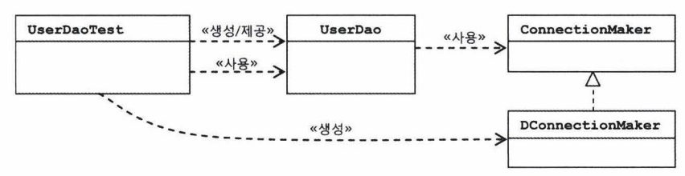

- 위와 같은 구조로 리팩터링
- UserDao와 ConnectionMaker를 분리해 User와 관련된 관심사를 분리
- User와 관련된 로직은 UserDao에서만 변경되고, ConnectionMaker는 변경에 대한 여파를 받지 않음
- DB 커넥션과 관련된 로직은 ConnectionMaker의 구현체에서만 변경되고, UserDao는 변경에 대한 여파를 받지 않음
- 적용된 원칙과 패턴
    - 개방 폐쇄 원칙 적용
    - 높은 응집도와 낮은 결합도

## SOLID

- S : 단일 책임 원칙
- O : 개방 폐쇄 원칙
- L : 리스코프 치환 원칙
- I : 인터페이스 분리 원칙
- D :  의존 관계 역전 원칙

- 책에서는 관심사를 분리하여 결과적으로 개방 폐쇄 원칙을 지켰다고 언급
    - 리팩터링 과정을 통해 UserDao와 ConnectionMaker가 서로 영향을 받지 않도록 함
        - 두 개의 대상은 높은 응집도와 낮은 결합도를 가지게 됨
        - 서로가 변경되더라도 자기 자신만이 변경되고 다른 대상에게는 영향을 주지 않음
- 리팩터링 과정에 초점을 맞추면 개방 폐쇄 원칙보다는 단일 책임 원칙을 지키기 위한 과정이라고도 볼 수 있음
    - 두 개의 대상이 가지게 되는 관심사(책임)을 하나로 만드는 과정이기 때문
- 관점에 따라 어떤 원칙을 지켰는지가 달라질 수 있는 이유는 각 원칙이 서로에게 유기적으로 영향을 끼치기 때문
- 이 중 가장 기본이 되는 원칙은 단일 책임 원칙이라고 볼 수 있음
    - 개방 폐쇄 원칙에 미치는 영향
        - 단일 책임 원칙으로 인해 각 클래스가 하나의 책임을 가지게 됨
        - 기능 추가 / 변경 시 다른 부분에 영향을 미치지 않고 쉽게 확장할 수 있음
        - 개방 폐쇄 원칙의 확장에는 열려있고 수정에는 닫혀있어야 한다는 원칙을 지원
    - 리스코프 치환 원칙에 미치는 영향
        - 단일 책임 원칙으로 각 클래스의 책임이 명확해짐
        - 확장 시 서브 클래스가 슈퍼 클래스의 책임을 온전히 수행할 수 있음
            - 상위 타입의 객체를 하위 타입의 객체를 치환해도 주어진 책임을 온전히 수행할 수 있음
        - 상위 타입의 객체를 하위 타입의 객체로 치환해도 정상 동작한다는 원칙을 지원
    - 인터페이스 분리 원칙에 미치는 영향
        - 단일 책임 원칙은 클래스 수준에서 책임을 분리하지만 인터페이스 분리 원칙은 인터페이스 수준에서 책임을 분리
        - 단일 책임 원칙을 잘 지키게 되면 자연스럽게 인터페이스 분리 원칙도 지키기 쉬워짐
    - 의존성 역전 원칙에 미치는 영향
        - 단일 책임 원칙을 지키면 각 모듈의 책임이 명확해지고 의존성이 줄어듦
        - 이를 토대로 의존성 역전 원칙을 지키기 용이해짐
        - 상위 수준의 모듈이 하위 수준의 모듈에 의존하지 않고, 둘 모두 추상화에 의존하게 되어 시스템의 결합도를 낮출 수 있음

## 전략 패턴

- UserDao는 DB 커넥션 관련 로직을 전략 패턴을 통해 결정하고 있음
- 전략 패턴
    - 자신의 기능 문맥(Context)에서 변경이 필요한 알고리즘을 인터페이스를 활용해 외부로 분리시키고 구현한 구체적인 알고리즘 클래스를 필요에 따라 바꿔서 사용할 수 있게 하는 디자인 패턴
    - UserDao는 전략 패턴의 문맥(Context)에 해당
    - ConnectionMaker는 인터페이스를 활용해 외부로 분리시킨, 변경이 필요한 알고리즘에 해당

# 제어의 역전(IoC)

```java
public class UserDaoTest {

    public static void main(String[] args) throws ClassNotFoundException, SQLException {
        ConnectionMaker connectionMaker = new DConnectionMaker();
        UserDao dao = new UserDao(connectionMaker);
        
        ...
    }
}
```

- UserDaoTest는 두 가지 관심사를 가지게 됨
    - UserDao 테스트
    - UserDao가 사용할 ConnectionMaker 전략을 선택
- 팩토리를 활용해 오브젝트를 생성하는 쪽과 오브젝트를 사용하는 쪽의 역할과 책임을 분리
    - 애플리케이션의 컴포넌트 역할을 하는 오브젝트와 애플리케이션의 구조를 결정하는 오브젝트를 분리

```java
public class UserDaoFactory {

    public UserDao userDao() {
        UserDao dao = new UserDao(connectionMaker());
        return dao;
    }

    public ConnectionMaker connectionMaker() {
        ConnectionMaker connectionMaker = new DConnectionMaker();
        return connectionMaker;
    }
}

public class UserDaoTest {

    public static void main(String[] args) throws ClassNotFoundException, SQLException {
        UserDao dao = new UserDaoFactory().userDao();
        
        ...
    }
}
```

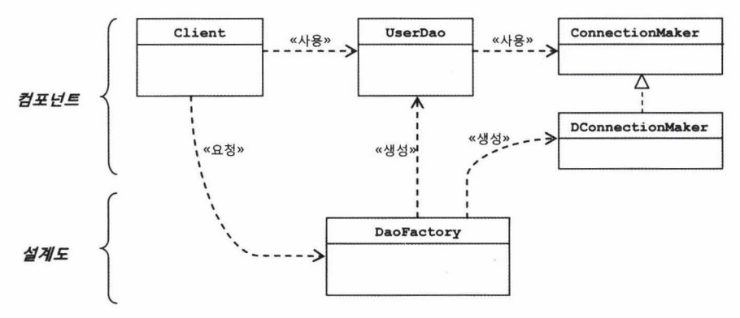

- DaoFactory는 각 오브젝트를 구성하고 관계를 정의하는 책임을 담당
- UserDao와 ConnectionMaker는 각각 애플리케이션의 핵심적인 데이터 로직과 기술 로직을 담당
- 실질적인 로직을 담당하는 컴포넌트
    - UserDao / ConnectionMaker
- 애플리케이션을 구성하는 컴포넌트의 구조와 관계를 정의한 설계도
    - DaoFactory

```java
@Configuration
public class DaoFactory {

    @Bean
    public UserDao userDao() {
        UserDao dao = new UserDao(connectionMaker());
        return dao;
    }

    @Bean
    public ConnectionMaker connectionMaker() {
        return new DConnectionMaker();
    }
}
```

- ConnectionMaker 구현 클래스의 오브젝트를 생성하는 코드가 중복되지 않도록 별도의 팩토리 메서드로 분리

## 제어권의 이전을 통한 제어 관계 역전

- 프로그램의 제어 흐름 구조가 뒤바뀌는 것
- 대표적인 예시로 프레임워크를 들 수 있음
- UserDao가 의존할 ConnectionMaker를 능동적으로 선택해 사용하는 것이 아닌, 외부에서 주입해 의존할 ConnectionMaker를 수동적으로 사용하는 것
    - 이러한 역할은 DaoFactory가 수행
    - 제어의 역전을 위해서 애플리케이션 컴포넌트의 생성과 관계 설정, 사용, 생명 주기 관리 등을 관장하는 대상이 필요함

# 스프링의 IoC

- 빈(Bean)
    - 오브젝트 단위의 애플리케이션 컴포넌트
    - 스프링 컨테이너가 생성과 관계 설정, 사용 등을 제어해주는 제어의 역전이 적용된 오브젝트
- BeanFactory
    - 빈의 생성과 관계 설정과 같은 제어를 담당하는 IoC 오브젝트
    - 빈을 생성하고 관계를 설정하는 IoC의 기본 기능에 초점을 맞춤
- ApplicationContext
    - BeanFactory를 확장한, IoC 방식을 따라 만들어진 일종의 빈 팩토리
    - 애플리케이션 전반에 걸쳐 모든 구성 요소의 제어 작업을 담당하는 IoC 엔진이라는 의미에 초점을 맞춤


## DaoFactory를 사용하는 애플리케이션 컨텍스트

- ApplicationContext는 별도의 정보를 참고해 빈의 생성, 관계 설정 등의 제어 작업을 총괄

```java
@Configuration
public class DaoFactory {

    @Bean
    public UserDao userDao() {
        UserDao dao = new UserDao();
        dao.setConnectionMaker(connectionMaker());
        return dao;
    }

    @Bean
    public ConnectionMaker connectionMaker() {
        ConnectionMaker connectionMaker = new DConnectionMaker();
        return connectionMaker;
    }
}
```

- @Configuration
    - ApplicationContext가 제어 작업을 하기 위해 필요한 별도의 정보임을 의미
- @Bean
    - ApplicationContext가 관리할 오브젝트를 만드는 팩토리 메서드임을 의미
    - 별도로 설정하지 않으면 메서드 네이밍이 등록된 빈의 이름이 됨

```java
public class UserDaoTest {

    public static void main(String[] args) throws ClassNotFoundException, SQLException {
        AnnotationConfigApplicationContext context = new AnnotationConfigApplicationContext(DaoFactory.class);
        UserDao dao = context.getBean("userDao", UserDao.class);
        
        ...
    }
}
```

- getBean() 메서드를 통해 등록한 빈을 조회할 수 있음

## 애플리케이션 컨텍스트의 동작 방식

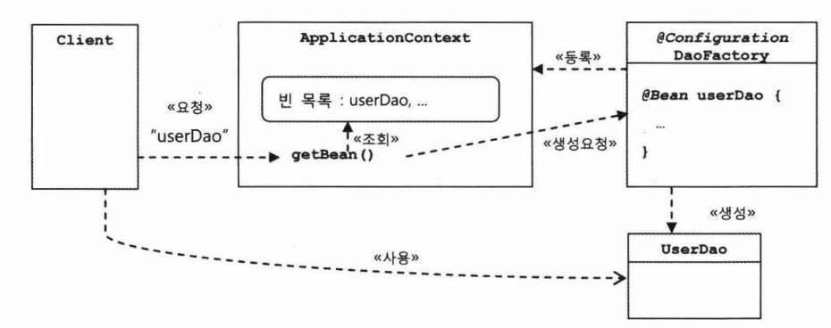

- DaoFactory 클래스를 설정 정보로 등록
    - DaoFactory 내부 @Bean이 붙은 메서드의 이름을 가져와 빈 목록 생성
- 클라이언트가 getBean()을 통해 빈을 요청하면 빈 목록에서 요청한 이름이 있는지 확인
    - 빈 목록에 있다면 빈을 클라이언트에 반환
- 장점
    - 클라이언트는 구체적인 팩토리 클래스를 알 필요가 없음
    - 애플리케이션 컨텍스트는 종합 IoC 서비스 제공
    - 애플리케이션 컨텍스트는 빈을 검색하는 다양한 방법 제공

## 스프링 IoC의 용어 정리

- 빈
    - 스프링이 IoC 방시긍로 관리하는 오브젝트란 의미
    - 관리되는 오브젝트(managed object)라고 표현하기도 함
- 빈 팩토리
    - 스프링의 IoC를 담당하는 핵심 컨테이너
- 애플리케이션 컨텍스트
    - 빈 팩토리를 확장한 IoC 컨테이너
    - 빈 팩토리의 기능에 추가로 스프링이 제공하는 부가 서비스를 제공
- 설정 정보 / 설정 메타 정보
    - 애플리케이션 컨텍스트 / 빈 팩토리가 IoC를 적용하기 위해 사용하는 메타 정보
- 컨테이너 / IoC 컨테이너
    - IoC 방식으로 빈을 관리한다는 의미
    - 애플리케이션 컨텍스트 / 빈 팩토리를 지칭하는 방식
    - IoC 컨테이너
        - 빈 팩토리 관점에서 표현하는 방식
    - 컨테이너 / 스프링 컨테이너
        - 애플리케이션 컨텍스트 관점에서 표현하는 방식
- 스프링 프레임워크
    - IoC 컨테이너, 애플리케이션 컨텍스트를 포함해 스프링이 제공하는 모든 기능을 통틀어 말할 때 사용

# 싱글톤 레지스트리와 오브젝트 스코프

- 애플리케이션 컨텍스트는 싱글톤을 저장하고 관리하는 싱글톤 레지스트리
    - 스프링은 스스로의 정체성을 싱글톤 레지스트리라고 표현
- 스프링이 싱글톤으로 빈을 관리하는 이유
    - 스프링이 주로 적용되는 대상이 자바 엔터프라이즈 기술을 사용하는 서버 환경이기 때문
    - 매번 클라이언트에서 요청이 올 때 마다 오브젝트를 새롭게 만들어서 사용하는 것은 매우 비효율적이기 때문
    - 디자인 패턴의 싱글톤 패턴을 사용하는 것이 아닌, 스프링 내부적으로 빈을 싱글톤으로 관리

## 싱글톤 패턴의 한계

```java
public class UserDao {
		
    private static UserDao INSTANCE;
    
    private UserDao(ConnectionMaker connectionMaker) {
        this.connectionMaker = connectionMaker;
    }
    
    public static synchronized UserDao getInstance() {
        if (INSTANCE == null) {
                INSTANCE = new UserDao(...);
        }
        
        return INSTANCE;
    }
}
```

- 한계점
    - private 생성자로 인해 상속할 수 있음
    - 테스트하기 힘듦
    - 서버 환경에서는 싱글톤이 하나만 만들어지는 것을 보장할 수 없음
    - 전역 상태를 만들 수 있기 때문에 바람직하지 못함

### 객체 지향에서의 싱글톤

- 객체 지향 프로그래밍이란 요구 사항을 해결하기 위해 특정 문맥 안에서 객체들이 주어진 책임을 다하며 역할을 수행하고, 필요하다면 다른 객체와 협력해 최종 목표인 애플리케이션의 기능을 클라이언트에게 제공하는 프로그래밍 방법론을 의미
- 이 과정에서 어떤 문맥에서 어떤 객체가 홀로 역할을 수행하기 어려울 때, 다른 객체와 협력하는 과정에서 의존 관계가 발생함
    - A가 B와 의존하기 위해 A가 어디서 생성되는지, B가 어디서 생성되는지 또한 문맥 안에서 중요한 정보
- 즉 문맥과 문맥에 참여하는 객체에 따라 의존 관계가 달라질 수 있음
- 싱글톤의 경우 이러한 문맥을 무시하고 어디에서나 호출될 수 있기 때문에 객체 지향적으로 바람직하지 않음
    - 전역 상태가 객체 지향과 어울리지 않는 이유

## 싱글톤 레지스트리

- 싱글톤 레지스트리
    - 스프링이 직접 싱글톤 형태의 오브젝트를 만들고 관리하는 기능
    - 평범한 자바 클래스를 싱글톤으로 활용하게 해준다는 장점이 있음
        - 싱글톤 패턴과 달리 객체 지향적인 설계 방식과 원칙, 디자인 패턴을 적용하는데 제약이 없음

## 싱글톤과 오브젝트의 상태

- 싱글톤은 멀티 스레드 환경일 때 여러 스레드가 동시에 접근해서 사용할 수 있으므로 상태 관리에 주의해야 함
    - 일반적으로 멀티 스레드 환경에서의 싱글톤은 무상태 방식으로 만들어져야 함

## 스프링 빈의 스코프

- 스프링이 관리하는 빈의 범위를 스코프(scope)라고 함
- 스프링 빈의 기본 스코프는 싱글톤
- 스프링 빈은 다양한 스코프를 가질 수 있으며, 상황에 따라 사용

# 의존 관계 주입(DI)

- IoC는 소프트웨어에서 자주 발견할 수 있는 일반적인 개념
- 스프링에서의 IoC는 이질적이기 때문에 스프링을 IoC 컨테이너라고만 표현해서는 그 특징을 제대로 설명할 수 없음
- 스프링이 제공하는 IoC의 핵심을 설명할 수 있는 의존 관계 주입(Dependency Injection)이라는 이름으로 표현
- 의존 관계 주입이란 다음과 같은 세 가지 조건을 충족하는 작업을 의미
    - 클래스 모델이나 코드에는 런타임 시점에 의존관계가 드러나지 않음
        - 인터페이스에만 의존
    - 런타임 시점의 의존 관계는 컨테이너 / 팩토리와 같은 제 3의 존재가 결정
    - 의존 관계는 사용할 오브젝트에 대한 레퍼런스를 외부에서 제공(주입)해 만들어짐

## 의존 관계

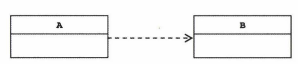

- A가 B에 의존하고 있음
- 의존하고 있다는 것은 변경에 영향을 미친다는 것을 의미
    - B가 변경되면 A가 영향을 받음
- 의존 관계는 방향성이 있음
    - A가 변경되어도 B는 영향을 받지 않음

## UserDao의 의존관계

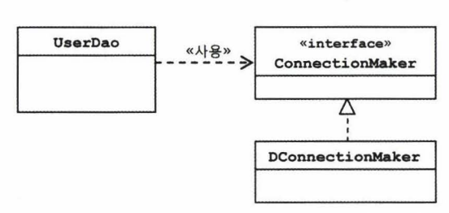

- 인터페이스를 통해 느슨한 결합을 가지게 됨
    - DConnectionMaker가 변경되어도 UserDao는 ConnectionMaker를 의존하고 있기 때문에 변경에 영향을 받지 않음
    - UserDao는 ConnectionMaker를 의존하고 있으므로 런타임 시점에 어떤 ConnectionMaker의 구현체를 의존할지 알 수 없음
- 의존 관계 주입이란 런타임 시에 의존 관계를 맺는 오브젝트인 의존 오브젝트와 클라이언트를 연결해주는 작업을 의미

## UserDao의 의존 관계 주입

```java
public UserDao() {
		this.connectionMaker = new DConnectioMaker();
}
```

- 의존 관계 주입 전의 의존 관계
    - UserDao가 사용할 ConnectionMaker의 구현체 DConnectionMaker를 구체적으로 알고 있음

```java
public UserDao(ConnectionMaker connectionMaker) {
		this.connectionMaker = connectionMaker;		
}
```

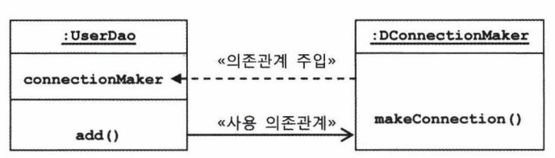

- 의존 관계 주입 후의 의존 관계
    - 컴파일 시점에서는 ConnectionMaker에 의존
    - 런타임 시점에서는 DI 컨테이너를 통해 사용 의존관계인 DConnectionMaker에 의존

## 의존 관계 검색과 주입

```java
public UserDao() {
		DaoFactory daoFactory = new DaoFactory();
		this.connectionMaker = daoFactory.connectionMaker();
}
```

- IoC 개념을 따르고 있음
    - UserDao는 ConnectionMaker 인터페이스에만 의존
- UserDao는 외부에서 사용 의존 관계를 직접 주입받는 것이 아닌, IoC 컨테이너에게 요청해 능동적으로 찾아옴
    - UserDao 관심사와 무관한 IoC 컨테이너에 대한 의존이 추가됨
    - 일반적으로 의존 곤계 주입이 더 효율적

## 의존 관계 주입의 응용

- 기능 구현의 교환
    - 서버 환경에 따라 사용 의존관계를 교환
- 부가 기능 추가
    - 핵심 관심사가 아닌 부가 관심사를 프록시 패턴 혹은 데코레이터 패턴을 활용해 구현 가능
    - 이 과정에서 패턴을 적용한 대상을 의존하고 있는 코드는 전혀 변경되지 않음

## 메서드를 이용한 의존 관계 주입

- 의존 관계 주입에는 생성자를 활용한 방법 외에도 다양한 방법이 존재
    - 수정자(setter) 메서드를 응용한 주입
    - 일반 메서드를 이용한 주입
- 생성자를 활용한 방법을 권장
    - 스프링 4.3에서 생성자 주입 사용 시 @Autowired를 생략해도 될 정도로 일반적인 방식으로 취급
    - 메서드를 이용해 의존 관계를 주입할 경우 동적으로 사용 의존 관계를 변경할 수 있지만, 필요한 경우가 적을 뿐만 아니라 사용하고 있던 대상이 예기치 못하게 변경되어 문제가 발생할 수도 있음

## DIP, Separated Interface

- DIP
    - SOLID 원칙 중 하나
    - 상위 수준의 모듈은 하위 수준의 모듈에 의존해서는 안 되며, 둘 모두 추상화에 의존해야 함
    - 추상화는 구체적인 사항에 의존해서는 안 되며, 구체적인 사항은 추상화에 의존해야 함

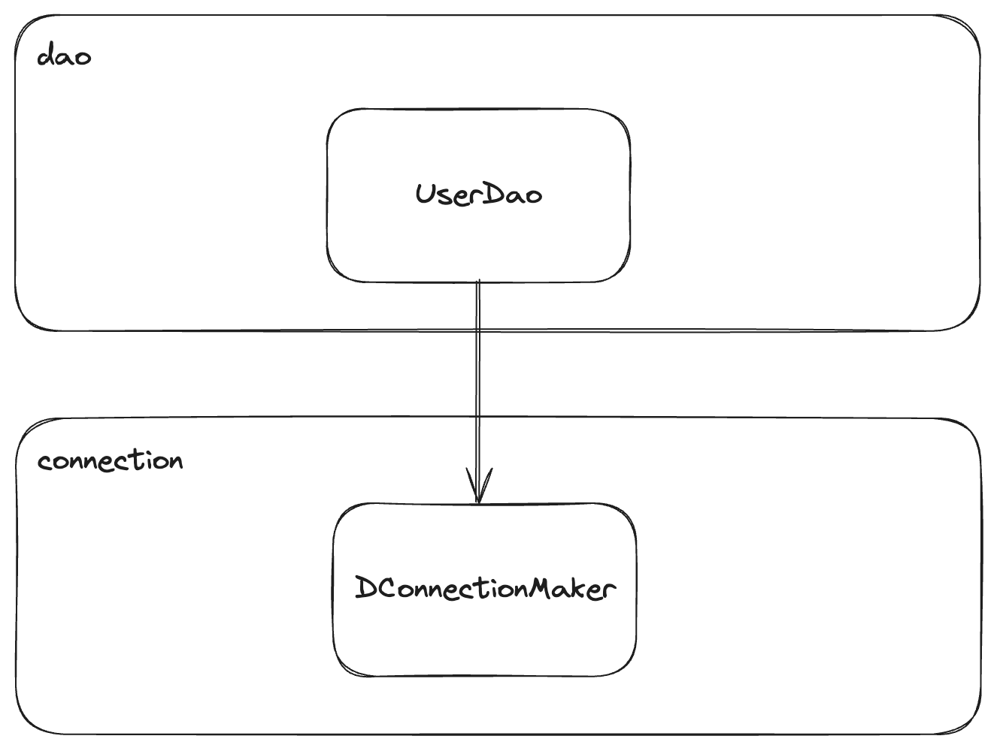

- UserDao와 DConnectionMaker를 관심사에 따라 별도의 패키지로 분리
- UserDao가 DConnectionMaker에 직접 의존
- DIP 원칙 중 추상화에 의존해야 한다는 원칙을 어기고 있음

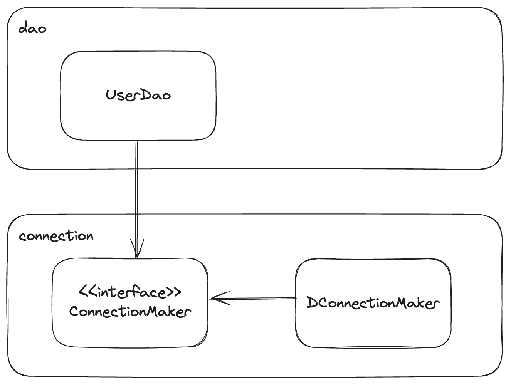

- 추상화에 의존하도록 인터페이스를 생성
- UserDao는 인터페이스에 의존
- DConnectionMaker는 인터페이스를 구현
- DIP 원칙에서 상위 수준의 모듈은 하위 수준의 모듈에 의존해서는 안 된다는 원칙을 어기고 있음

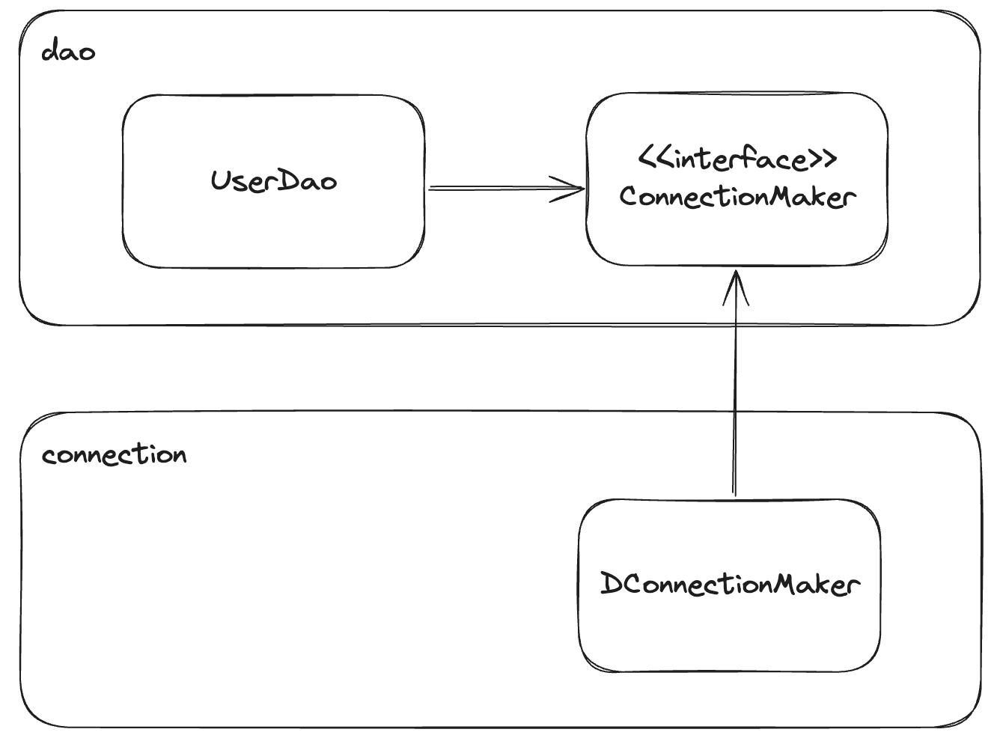

- Seperated Interface 패턴을 적용해 인터페이스의 패키지 위치를 변경

# DataSource 인터페이스로 변환

- ConnectionMaker는 DB 커넥션을 생성해주는 기능 하나만을 정의한 매우 단순한 인터페이스
- 자바에서는 DB 커넥션을 가져오는 오브젝트의 기능을 추상화한 DataSource 인터페이스가 이미 존재함

```java
public class UserDao {

    private DataSource dataSource;

    public void setDataSource(DataSource dataSource) {
        this.dataSource = dataSource;
    }

    public void add(User user) throws SQLException {
        Connection c = this.dataSource.getConnection();
        
        ...
    }

    public User get(String id) throws SQLException {
        Connection c = this.dataSource.getConnection();
        
        ...
    }
}
```

# XML을 이용한 설정

생략

# 정리

- 사용자 정보를 DB에 등록하거나 아이디로 조회하는 기능을 가진 DAO 코드 작성
- DAO 코드의 문제점을 다양한 방법과 패턴, 원칙, IoC/DI 프레임워크를 적용해 개선
- 과정
    - 책임이 다른 코드를 분리해서 두 개의 클래스로 생성(관심사의 분리, 리팩터링)
    - 바뀔 수 있는 쪽의 클래스는 인터페이스로 구현하고, 다른 클래스에서 인터페이스를 통해서만 접근하도록 설정
        - 인터페이스를 정의한 쪽의 구현 방법이 달라져 클래스가 변경되더라도 그 기능을 사용하는 클래스의 코드는 같이 수정할 필요가 없어짐(전략 패턴)
    - 자신의 책임 자체가 변경되는 경우 외에는 불필요한 변화가 발생하지 않도록 막고 자신이 사용하는 외부 오브젝트의 기능은 자유롭게 확장 / 변경이 가능하도록 설정(개방 폐쇄 원칙)
    - 한 쪽의 기능 변화가 다른 쪽의 변경을 요구하지 않아도 됨(낮은 결합도)
    - 자신의 책임과 관심사에만 순수하게 집중하는 깔끔한 코드가 됨(높은 응집도)
    - 오브젝트가 생성되고 여타 오브젝트와 관계를 맺는 작업의 제어권을 별도의 오브젝트 팩토리로 처리
        - 오브젝트 팩토리의 기능을 일반화한IoC 컨테이너로 넘겨 오브젝트가 자신이 사용할 대상의 생성이나 선택에 관한 책임으로부터 자유롭게 설정(제어의 역전/IoC)
    - 전통적인 싱글톤 패턴 구현 방식의 단점을 살펴보고 서버에서 사용되는 서비스 오브젝트로서의 장점을 살릴 수 있는 싱글톤을 사용하면서도 싱글톤 패턴의 단점을 극복할 수 있도록 설계된 컨테이너를 활용하는 방법을 알아봄(싱글톤 레지스트리)
    - 실계 시점과 코드에는 클래스와 인터페이스 사이의 느슨한 의존관계만 만들어놓고 런타임 시에 실제 사용할 구체적인 의존 오브젝트를 제 3자(DI 컨테이너)의 도움으로 주입받아 다이나믹한 의존 관계를 갖게 해 주는 IoC의 특별한 케이스를 알아봄(의존 관계 주입 / DI)
    - 의존 오브젝트를 주입할 때 생성자를 이용하는 방법과 수정자 메서드를 이용하는 방법을 알아봄(생성자 주입과 수정자 주입)
